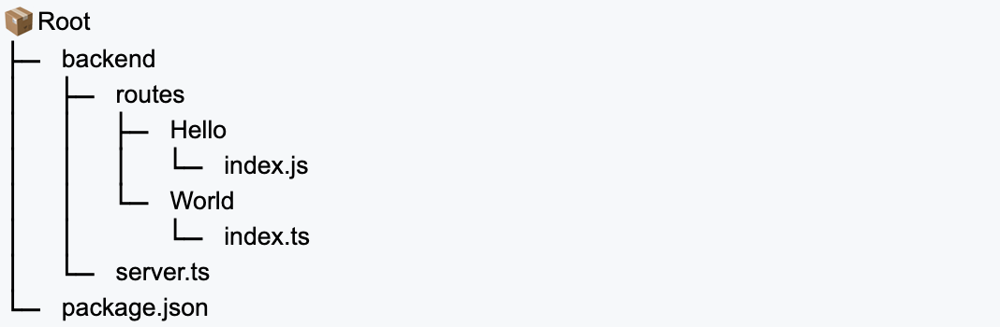
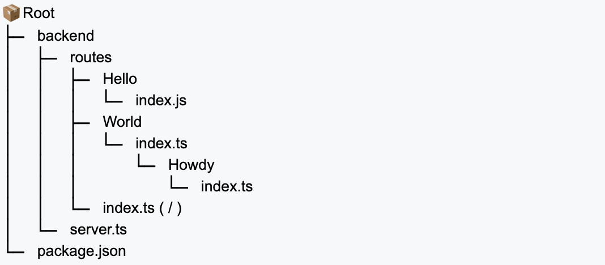

# Mz-Autorou-ts &#128739;

Helps you mapping your routes by folder structure instead of having you write routing of your endpoints by hand. 

Mapping/register endpoints can lead to a certain amount of stress. It is error prone because it is repetitive; it is boring because you have to edit the same server file over and over. This is not fun, it can seem to be a waist of time. If you can remove that editing of your workflow, you would gain extra time to address real needs!

Well, why not consider this little tool then ?

With this, in practice, you would just have to create a folder structure, let's say `backend/routes` containing your *exporting-router-modules*, then start cooking real stuffs !

> **JS version**
> This is the TS project ! Since not everyone can set foot into **Typescript**, a **JavaScript** version is alse available [here](https://www.npmjs.com/package/maze-autoroute).

# Getting started


1. Create a `backend` folder, go into it and run these commands :
    ```bash
    $ npm init
    
    $ npm install mz-autorou-ts
    $ npm install express 
    ```

1. Create a `server.ts` file which has the following code : 
    ```ts
    import express from "express";
    import { Autoroute } from "mz-autorou-ts";
    import { ModuleBundle } from "../src/types.js";
    const app = express();

    // ROUTES ----------------------------------------------------------
    const onmatch = async ({ route, module }: ModuleBundle) => {
        const { router } = await module

        return app.use(route, router);
    }
    const options = {
        // Put your options here
        onmatch
    }

    const autoroute = new Autoroute();
    autoroute.getMapping(options);
    // END ROUTES ------------------------------------------------------

    // Listening parameters
    app.listen(4000, () => {
        console.log("\nReady on port: " + 4000);
    });
    ```
### Try it !

1. Create the `/backend/routes` folder structure.
1. Create two folders in `/backend/routes`: `Hello` and `World`. Each containing this code : 
```js
import express from "express";
import { fileURLToPath } from 'url';
import { dirname } from 'path';
const __filename = fileURLToPath(import.meta.url);
const __dirname = dirname(__filename);
const router = express.Router();

router.get('/', async (req, res) => {
    res.send(`Welcome to this resource at FOLDER ${__dirname.replace(process.cwd(),"")}`);
})

router.get('/greet/name/:something', async (req, res) => {
    res.send(`Please to meet you ${req.params.something} ! I'm an endpoint defined at FOLDER ${__dirname.replace(process.cwd(),"")}`);
})

export { router }
```
3. Run your server at the root folder.
   Let's assume that your project is structured like this at this stage:
   
   ```sh
   $ node backend/server.ts
   #OR if you have nodemon
   $ nodemon --esm backend/server.ts
   ```
4. Notice that you did not write any routing code ! As simple as that

## Options

The autoroute'r comes with its range of options, find here what you need.

| Option       | default                                   | type            |
| ------------ | ----------------------------------------- | --------------- |
| `onmatch`      | `match => {}`                             | `Function`        |
| `onerr`        | `({message}) => { console.log(message) }` | `Function`        |
| `rootp`        | `'backend/routes/'`                               | `string`          |
| `subr`         | `null`                                      | misc            |
| `translations` | `[]`                                        | `{ from:string,to:string }[]` |
| `verbose`      | `false`                                     | `boolean`            |
|`frame`         |`{ before: "", after: "" }`                | `{ before:string, after:string }`          |
|`flat`          |`false`|`boolean`|

To set these options, refere to that part of the code show in the example of `server.ts` above : 
```ts
const options = {
    // Put your options here
    onmatch
}
```
### Non modifier options
These options will affect the way this tool is handling events and inputs while generating the routing.

### `onmatch`
<small>onmatch : `on match`</small>
Function to pass to be apply on every route at the final process. That process iterates over simple objects containing the final route string (route) and the path to the module (module) relative to the given base folder path given by the <b>option</b> `rootp`.

```js
const onmatch = async ({ route, module }: ModuleBundle) => {
    const { router } = await module

    return app.use(route, router);
};
```

Sticking to this sniped is the better practice. Since the AutoRouter is calling `onmatch` anyway.

___

#### `onerr`
<small>onerr : `on error`</small>
Function to pass to handle exceptions that can very unlikely  happen during the auto routing. 
You may prefer to stick to the default value:

```js
const onerr = ({message}) => { console.log(message) }; // default value
```

___

#### `rootp`
<small>rootp : `root path`</small>
Defines the root folder to loop <b>recursively</b> to create the based route tree dynamically.

```js
const rootp = 'backend/routes/'; // default value
```

**Note : the path should be relative to the server root level.**

#### `verbose`
<small>`verbose`</small>
Tells if you want to see the final resulting route list. It has `false`. Turn this option to `true` to see a list of your auto mapped routes.

```js
const verbose = false; // default value
```

### Modifier options
These options will affect the routing generated. These will do various manipulations to provide you with transformations you can perform to suite your routes organisation or allow you to disguise routing and provide fancyness.

Let's consider the following folder structure for these options and values.




#### `flat`
<small>flat : `flatten the routes tree`</small>
Maiby the most useful of options. This one let's you decide if the routes generated will be presented hierarchically or if they will be flatten at the same level even though your folder structure of routes is hierarchical.

```js
const flat = false; // default value
```
**true case**
```sh
AUTOROUTING: routes in 'routes/'
↪ [
  '/',              # not a leaf !
  '/helloworld',    # not a leaf !
  '/hello',         # a leaf !    
  '/world',         # not a leaf !
  '/howdy',         # a leaf !    
]
```
**false case**
```sh
AUTOROUTING: routes in 'routes/'
↪ [
  '/',                          # not a leaf !
  '/helloworld',                # not a leaf !
  '/helloworld/hello',          # a leaf !    
  '/helloworld/world',          # not a leaf !
  '/helloworld/world/howdy',    # a leaf !    
]
```

#### `subr`

<small>subr : `sub route`</small>
Tells how to translate/transform a router that is part of the route (sub route or a segment). Since the structure of folder can be an analogy to a tree, we will talk about root, branches(segments), and leaves here.  

> **Note: 
Providing that special translation may avoid further eventual conflicts. Even if routes work in the first place... prevention is the key!**

The value of subr can be either of these : 
```js
[ null | 'b64' | 'cptlz' | 'obj' ]
```
use like this
```js
const subr = null ; // default value
```
**null case** : Take this following unchanged mapping. `subr` is `null` by default:
```sh
AUTOROUTING: routes in 'routes/'
↪ [
  '/',                          # not a leaf !  > ... /
  '/helloworld',                # not a leaf !  > ... helloworld
  '/helloworld/hello',          # a leaf !      > ... hello
  '/helloworld/world',          # not a leaf !  > ... world
  '/helloworld/world/howdy',    # a leaf !      > ... howdy
]
```
**cptlz case** <small>`capitalize case`</small> : In this instance, the sub route will be capitalized ! `subr` is `cptlz` 

```sh
AUTOROUTING: routes in 'routes/'
↪ [
  '/', # nothing changed for the root ... (*)

  '/helloworld',                # not a leaf !  > ... Helloworld
  '/helloworld/hello',          # a leaf !      > ... hello
  '/helloworld/world',          # not a leaf !  > ... World
  '/helloworld/world/howdy',    # a leaf !      > ... howdy
]
```


**b64 case** : In this following mapping ; `subr` is `'b64'` :
```sh
AUTOROUTING: routes in 'routes/'
↪ [
  '/', # nothing changed for the root ... (*)

  '/helloworld',                # not a leaf !  > ... aGVsbG93b3JsZA
  '/helloworld/hello',          # a leaf !      > ... hello
  '/helloworld/world',          # not a leaf !  > ... d29ybGQ 
  '/helloworld/world/howdy',    # a leaf !      > ... howdy
]
```
**obj case**
Obj case is a bit different, it will require you to set the option `"frame"`

`frame` **{before:'Hi_',after:'_Bye'} case** : In this following mapping ; 
`subr` is `obj` AND `frame` is `{before:'Hi_',after:'_Bye'}` :
```sh
AUTOROUTING: routes in 'routes/'
↪ [
  '/', # nothing changed for the root ... (*)

  '/helloworld',                # not a leaf !  > ... Hi_helloworld_Bye
  '/helloworld/hello',          # a leaf !      > ... hello
  '/helloworld/world',          # not a leaf !  > ... Hi_world_Bye  
  '/helloworld/world/howdy',    # a leaf !      > ... howdy
]
```
**Note : you don't have to set both `before` and `after` fields for the `subr` because these are applied if a value is set for either before or after or both fields as checked in the AutoRouter logic**


#### `translations`
<small>`translations`</small>
Helps to customize routes in the final mapping. 
The Autoroute will iterate over the `translations` to see if a `from` fully matchs a route in the mapping and thus it will replace that matching route by the `to` string.

**Note : none of the `from` or the `to` should have trailing slashes `'/'`.**
For this instance, we may want to hide the infirm part of the route because it may hurt some feelings.

```js
const translations = [{ 
    from : '', 
    to : 'home'
},
{
    from : 'helloworld/world/howdy',
    to: 'yo'
}];
```

```sh
AUTOROUTING: routes in 'routes/'
↪ [
  '/home',                      # / => /home !!!
  '/helloworld',                # unchanged
  '/helloworld/wello',          # unchanged
  '/helloworld/world',          # unchanged
  '/helloworld/world/howdy',    # /helloworld/World/Howdy => /yo
]
```
___
# Licence
[MIT](https://github.com/ManuUseGitHub/Maze-Autoroute/blob/main/LICENSE)
